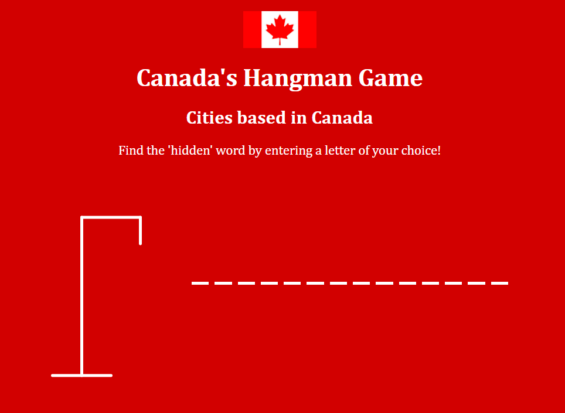

# **Canada’s Hangman!**

## Canada’s Hangman is a JS based game developed by Mohammad Ali Khan. Hangman is essentially a game played by everyone at some point in their lives either in their childhood or in class. The main purpose is to guess a word that is related to the topic.

# **Instructions**
     
## The player must type in a letter from their keyboard to start the game. The current category is set on “Cities of Canada”. Once a letter is typed in, either the game defines it as correct and gives it a position, or if it’s incorrect, the game will notify the player and will initiate the hanging.

# **Getting Started**

## Play the game using the following link: [Canada's Hangman Game](https://mnzvr97.github.io/First-Project/)
## Hope you enjoy the game!

# **Technologies**

## This game was developed in VS Code using HTML, JavaScript & CSS.

# **Screenshots**
 

# **Future Steps**
##   In the following weeks, I intend to add additional features such as; 
###   1.	Score board
###   2.	Multiple players
###   3.	Improved graphics 
###   4.	Additional categories
####   a.	Countries
####   b.	Provinces

